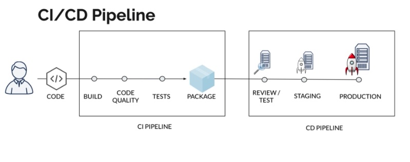

# CI/CI Pipelines with Gitlab

Notes written after following
Udemy course by Valentin Despa
GitLab CI: Pipelines, CI/CD and DevOps for Beginners.

A PDF of the course note created by the instructor can be downloaded from
[gitlab-ci-course-notes.pdf](https://buildmedia.readthedocs.org/media/pdf/gitlab-ci-course-notes/latest/)

Mikel Sagardia, 2021.
No warranties.

Overview:
1. Introduction
2. Basic CI/CD Workflow with Gitlab
3. Gitlab CI Fundamentals
4. YAML Basics
5. Deploying a Complex Application

I thoroughly did all 1-4 sections and tried them myself, but I just watched the Section 5 and made some notes.

## Section 1: Introduction

As I understand, **Continuous Integration and Continuous Delivery (CI/CD)** consists in:
- Frequently merging new features to our versioned code
- Automatically and frequently building our codebase
- Assessing the quality of our code
- Automatically testing our built binaries
- Frequently deploying our packages to production; deployment encompasses: installation in an environment and tests

Therefore, CI/CD has these advantages:
- It ensures that changes are releasable
- It reduces the risk of a new deployment
- It delivers value much faster

The steps in the CI/CD pipeline can be broken down to the following phases:
1. Coding: teams code together in a versioned (git) repository, following social coding techniques: frequent commits, parallel branches, pull requests, code reviews, merges, etc.
2. CI Pipeline: Continuous Integration
  - Build
  - Code Quality checks
  - Tests (eg., unit tests)
  - Package: pack everything as it is going to be deployed
3. CD Pipeline: Continuous Deployment/Delivery
  - Review/Test
  - Staging: pre-production simulated deployment
  - Production: final deployment



Gitlab CI is gaining markets share in contrast to older CI/CD frameworks (e.g., Jenkins) because it integrates all steps for CI/CD in a platform.

Gitlab can be used
- online: repositories are hosted in Gitlab's servers; offers 30h of pipeline time in its free tier. If we want more, we need to pay.
- self-managed: we install the Gitlab platform; we can do unlimited CI/CD in the free tier. But we get no support for it.

### 1.1 Introductory example: `build a car`

The introduction uses the example of building a car:
a `car.txt` file will be created and the likes `chassis`, `engine`, `wheels` added to it.
We log in to Gitlab & create a new private project: `cicd_tests`.
We create a new file with a specific name in the **highest or root** level: `.gitlab-ci.yml`:


```yml
build the car:
  script:
    - mkdir build
    - cd build
    - touch car.txt
    - echo "chassis" >> car.txt
    - echo "engine" >> car.txt
    - echo "wheels" >> car.txt
```

Right vertical menu: CI/CD, Pipelines:
- We'll see the pipeline which is executed
- If we click on the job, we'll see the terminal execution of the pipelines.
- We have currently one job, `build the car`, but we can add more jobs.
- Each job conatains at least one script.
- Note that pipelines do not locally on our host, but on Gitlab runners that are executed on the Gitlab servers; also, any files we create in a job are not saved to our repository.
- Note that 2 spaces must be used for indenting the YAML files.

We can improve that pipeline adding another job called `test the car` as follows:
- We define the job `test the car`, where the `car.txt` file is checked.
- We define `stages` and assign each job a stage so that the order of job execution can be controlled.
- If we don't assign a stage to a job, Gitlab automatically assigns the job the stage `test`
- The order of the stage defines the order of execution of the jobs.
- Note that each job is executed independently and the files produced in them are not saved unless we actively define `artifacts`.
- The `test the car` job needs to check the content of the `car.txt` file created in the job `build the car` with `test` and `grep` Linux commands; therefore, we need to define `artifacts`and add the files/paths we'd like to save.
- If we go to the vertical menu CI/CD > Jobs
    - we see the history of executed jobs
    - we can open the shell of the job clicking on passed/failed
    - we can download the artifacts of a job clicking on the donwload icon

```yml
stages:
  - build
  - test

build the car:
  stage: build
  script:
    - mkdir build
    - cd build
    - touch car.txt
    - echo "chassis" >> car.txt
    - echo "engine" >> car.txt
    - echo "wheels" >> car.txt
  artifacts:
    paths:
      - build/
test the car:
  stage: test
  script:
    - ls
    - test -f build/car.txt
    - cd build
    - cat car.txt
    - grep "chassis" car.txt
    - grep "engine" car.txt
    - grep "wheels" car.txt 
```

### 1.2 Gitlab Architecture

We have two main elements:
1. The **Gitlab server**: it offers the functionality for creating repositories and it saves them in databases. It also controls the pipelines we create, but it delegates their execution to the Gitlab runners.
2. The **Gitlab runners**: docker containers that run the jobs/tasks we define in the pipeline; the Gitlab runners are launched and managed by the Gitlab server. Each runner is also in charge of saving the artifacts. We can also scale up/down the number of runners used for the jobs.

If we look at the job shells, we'll see they are docker images which are built and run.
Within the container, our repository is cloned and the pipeline executed. Then, the artifacts are saved and the container is destroyed.

On the vertical menu under Settings > CI/CD > Runners we can select if we use the default shared runners provided by Gitlab or if we want to use our specific runners; the latter makes sense if we want to perform intensive CPU/GPU work in our pipelines.

## Section 2: Basic CI/CD Workflow with Gitlab

In this section a static website is built using `Node.js` and `npm`.
`Node.js` is a Javascript runtime environment able to run Javascript without needing a browser; `npm` is the Node Package Manager for it.

Installation and Setup (on Mac):
```bash
brew install node
node -v # we should see the version
npm -v # we should see the version
# install Gatsby CLI
npm install -g gatsby-cli
# create a new website repository locally
cd ~/git_repositories
gatsby new static-website
cd static-website
# we start the local developer server
gatsby develop
# now, we can open our website
# on the browser: localhost:8000
#
# On Gitlab, we create a new (private) project
# my-static-website
# and we connect it to the local repository that is created
# when creating the website
# note the name of the branch is master, not main...
git remote add origin git@gitlab.com:mxagar/my-static-website.git
git push -u origin master
# We can create a bundle of files with gatsby
# which collects all files necessary to deploy our website
# The created bundle/folder is called public/
# it will be our artifact
gatsby build
# We now open the local static-website project
# with ane editor, say VS Code,
# and create and edit a pipeline file:
# .gitlab-ci.yml
```

### 2.1 First Gitlab Pipeline for the Static Website

Now, we'd like to pack all this into a itlab pipeline.
Notes for the CI/CD pipeline on Gitlab:
- The file `static-website/package.json` defined all the dependencies needed for our website, which are installed in the git-ignored folder `static-website/node_modules`.
- Since we use docker containers for CI, we actively need to install the dependencies every time, thus, the installation commands must appear in our `.gitlab-ci.yml` file.
- Additionally, we need to take a `node` docker image for our pipeline, otherwise a default `ruby` image is used (which has no `node` platform).
- If we want the static website bundle, we need to save it as an artifact.


`.gitlab-ci.yml`:
```yaml
build the website:
  image: node
  script:
    - npm install
    - npm install -g gatsby-cli
    - gatsby build
  artifacts:
    paths:
      - ./public
```

The pipeline should be executed automatically.
The execution can be check on the vertical menu `Pipeline`, and the artifacts that are generated can be downloaded/browsed.


### 2.2 Adding a Test Stage

A job that is successful returns `0`, otherwise a value in the range `1-255`.
We can use this feature for executing unit tests.

In our simple example, we check whether `public/index.html` contains a certain string: `Gatsby`:

```bash
cd public
grep "Gatsby" index.html
# Grep in quiet mode: no output
grep "Gatsby" index.html
# To get the return status of the last command
echo $? # 0
```

Note that:
- The default image is `ruby`. We need to specify the image if we want another one that `ruby`; often the small/lightweight Linux distro `alpine` is chosen.
- Gatsby can serve the main website on `localhost:9000`, so we can check that using `curl` and `grep`; note that we need to add `tac` in-between so that `grep` receives the complete website.
- If a command is expected to block the terminal because it runs forever (eg., `gatsby serve`), we should add `&` to it. That way, the command is run in the background. However, we might need to add a `sleep` before the next command in case it depends on the previous blocking one.

`.gitlab-ci.yml`:
```yaml
stages:
  - build
  - test

build the website:
  image: node
  stage: build
  script:
    - npm install
    - npm install -g gatsby-cli
    - gatsby build
  artifacts:
    paths:
      - ./public

test artifact:
  image: alpine
  stage: test
  script:
    - grep -q "Gatsby" ./public/index.html

test website:
  image: node
  stage: test
  script:
    - npm install
    - npm install -g gatsby-cli
    - gatsby serve &
    - sleep 3
    - curl "http://localhost:9000" | tac | tac | grep -q "Gatsby"  
```

### 2.3 Deploying Our Website

The service offered by [surge.sh](https://surge.sh/) is used to deploy the static website. Surge is a cloud platform for serverless deployments; serverless means basically: we don't care how it works, we just execute simple commands for deployment and the server takes care of everything. Surge works very nicely with statc websites; it dynamically generates addresses.

```bash
# install surge
npm install --global surge
# go to the folder where the index.html is
cd ~/git_repositories/static-website/public
surge
# we login/create a surge account
# email
# pw
# a random name for the static website is suggested
# jumbled-can.surge.sh
# later on, we can change the name to a name acquired on namecheap.com
# or another service!
# firefox(jumbled-can.surge.sh)
```

### 2.4 Secrets

Secrets can be used to manage credentials; we don't want to commit them to git repositories. For that, environment variables are generated in the Gitlab web interface which are then available on the docker containers that perform the CI/CD pipeline. Note that many CLI tools rely on environment variables that need to be set on the Gitlab web interface.

```bash
# go to the folder where the index.html is and surge was run
cd ~/git_repositories/static-website/public
# generate a token
surge token
# On `gitlab.com/...`, vertical menu:
# Settings, CI/CD, Variables. We add the following:
# SURGE_LOGIN <our email> 
# SURGE_TOKEN <our newly generated token>
```

Now, we can create a new stage in which we deploy our website!
Note the following remarks:
- Since most jobs use the image `node`, we can put it up front and define `image` in jobs where it should be different than `node`.
- The environment variables for logging into surge are already set on the Gitlab web interface.
- We need to enconde the name of our website; either we use the name given by surge at the biginning or one we have specified on our surge account.
- The job(s) of the `deploy` stage are executed only after the previous have been executed correctly.

`.gitlab-ci.yml`:
```yaml
image: node

stages:
  - build
  - test
  - deploy

build the website:
  stage: build
  script:
    - npm install
    - npm install -g gatsby-cli
    - gatsby build
  artifacts:
    paths:
      - ./public

test artifact:
  image: alpine
  stage: test
  script:
    - grep -q "Gatsby" ./public/index.html

test website:
  stage: test
  script:
    - npm install
    - npm install -g gatsby-cli
    - gatsby serve &
    - sleep 3
    - curl "http://localhost:9000" | tac | tac | grep -q "Gatsby"  

deploy to surge:
  stage: deploy
  script:
    - npm install --global surge
    - surge --project ./public --domain jumbled-can.surge.sh
```

## Section 3: Gitlab CI Fundamentals

Overview of the most important aspects reviewed in this section:
- Environment variables.
- Scheduling of pipeline runs.
- Using cache to seep up builds.


### 3.1 Predefined Variables

Gitlab uses many **predefined** environment variables collected in this list:
[Gitlab CI/CD Predefined Variables](https://docs.gitlab.com/ee/ci/variables/predefined_variables.html).

Howver, more importantly, **we can also define variables according to the needs of the packages we use**, as we did with `surge`.

Some of the variables commented in this section:
- `CI_COMMIT_SHORT_SHA`: hash of the last commit done before running the pipeline.

#### Example: `CI_COMMIT_SHORT_SHA`

Let's say we'd like to add the hash of the commit to our website in order to display the version.
We can use the environment variable `CI_COMMIT_SHORT_SHA` for that, together with a marker placed in `index.js`.

First, we modify the `index.js`, which generates the `index.html` file:
```bash
# go to the folder where the index.html is and surge was run
cd ~/git_repositories/static-website/src/pages
# edit the JS file that generates the index.html file
vim index.js
# In the line right before </Layout>, we add
# <p>Version: %%VERSION%%</p>
```

When the website is built, `index.html` will contain a *'Version: %%VERSION%%'* string.
We need to change the `%%VERSION%%` marker with `$CI_COMMIT_SHORT_SHA`.
That can be achieved by adding a `sed` command to `.gitlab-ci.yml`.
`sed` can be used to substitute/replace strings in files and has the following usage:

```bash
sed -i 's/word1/word2/g' inputfile
# -i: edit in place, modify the same file, do not create a new one
# s: substitute
# word1: word to find and substitute
# word2: replace with this word
# g: global, if we'd like to run sed for all files
# inputfile: the file where it is run
```

Therefore, we need to add to `.gitlab-ci.yml`:
`sed -i "s/%%VERSION%%/$CI_COMMIT_SHORT_SHA/" ./public/index.html`

We can also test the deployment by checking the presence of some expected string in the served website.

**NOTE**: In my tests, the display of `CI_COMMIT_SHORT_SHA` did not work; probably due to some interactions with some other JS code.

`.gitlab-ci.yml`:
```yaml
image: node

stages:
  - build
  - test
  - deploy
  - deployment tests

build the website:
  stage: build
  script:
    - echo $CI_COMMIT_SHORT_SHA
    - npm install
    - npm install -g gatsby-cli
    - gatsby build
    - sed -i "s/%%VERSION%%/$CI_COMMIT_SHORT_SHA/" ./public/index.html
  artifacts:
    paths:
      - ./public

test artifact:
  image: alpine
  stage: test
  script:
    - grep -q "Gatsby" ./public/index.html

test website:
  stage: test
  script:
    - npm install
    - npm install -g gatsby-cli
    - gatsby serve &
    - sleep 3
    - curl "http://localhost:9000" | tac | tac | grep -q "Gatsby"

deploy to surge:
  stage: deploy
  script:
    - npm install --global surge
    - surge --project ./public --domain jumbled-can.surge.sh

test deployment:
  image: alpine
  stage: deployment tests
  script:
    - apk add --no-cache curl
    - curl -s "https://jumbled-can.surge.sh" | grep -q "Hi people"
    #- curl -s "https://jumbled-can.surge.sh" | grep -q "$CI_COMMIT_SHORT_SHA"
```

### 3.2 Retrying Failed Jobs and Scheduling.

If a job takes very long, it might happen that the next one fails due to timeout; thus, the pipeline fails.
We can re-run any job or pipeline by clicking on the wheel arrow.

We can also define schedules, eg., daily runs of a pipeline at a given time.
Vertical menu: CI/CD, Schedules, New Schedule.

### 3.3 Using Caches to Optimize the Build Speed

Compared to other CI/CD tools such as Jenkins, Gitlab requires longer times for building, because docker images need to be built and run. In other words: we're always starting new, even with the dependencies.

We can use caches to speed up that building process.
Usually, **dependencies are cached** for the `build` job.
However, cached files/folders are often define outside, globally, not just in the `build` job.
When defined globally, they are used by all jobs.
In our case, the dependencies are the ones downloaded with `npm install`.

We need to specify
- a `key`: usually a branch name comes here, which tells when to use the caching; we can also used the predefined environment variable `CI_COMMIT_REF_SLUG`;
- a `path`: directory/file to save and use

```yaml
cache:
  key: ${CI_COMMIT_REF_SLUG}
  paths:
    - node_modules/
```

If we run our pipeline +2, from the 2nd time on, the pipeline will run faster.
The first time we run our pipeline with the cache definition, the shell will have an error message due to the missing cache folder/file; however, it immediately creates one after checking that it is missing.
Note that sometimes caches missbehave; in these cases, we can clear the caches in the pipeline list/pane.

`.gitlab-ci.yml`:
```yaml
image: node

stages:
  - build
  - test
  - deploy
  - deployment tests

cache:
  key: ${CI_COMMIT_REF_SLUG}
  paths:
    - node_modules/

build the website:
  stage: build
  script:
    - echo $CI_COMMIT_SHORT_SHA
    - npm install
    - npm install -g gatsby-cli
    - gatsby build
    - sed -i "s/%%VERSION%%/$CI_COMMIT_SHORT_SHA/" ./public/index.html
  artifacts:
    paths:
      - ./public

test artifact:
  image: alpine
  stage: test
  script:
    - grep -q "Gatsby" ./public/index.html

test website:
  stage: test
  script:
    - npm install
    - npm install -g gatsby-cli
    - gatsby serve &
    - sleep 3
    - curl "http://localhost:9000" | tac | tac | grep -q "Gatsby"

deploy to surge:
  stage: deploy
  script:
    - npm install --global surge
    - surge --project ./public --domain jumbled-can.surge.sh

test deployment:
  image: alpine
  stage: deployment tests
  script:
    - apk add --no-cache curl
    - curl -s "https://jumbled-can.surge.sh" | grep -q "Hi people"
    #- curl -s "https://jumbled-can.surge.sh" | grep -q "$CI_COMMIT_SHORT_SHA"
```

#### Cache vs Artififacts

Both seem similar, but serve different purposes.
Artifacts are used to pass data products between jobs.
Caches are not to be used to store build results, but they should be used to store temporary project dependencies.

### 3.4 Deployment Environments

The CI/CD pipeline is more complex than the compilation of steps we have so far (see Section 1, Introduction).

By now, we do the continuous integration (CD) and then directly deploy it; however, it is very recommendable to add testing and staging steps before having the website live.

Additionally, we can use `environments`, which allow us to track deployments and their full history.

To activate environments, we need to add the following to deployment jobs:
```yaml
# deploy staging
enviornment:
  name: staging
  url: https://jumbled-can-staging.surge.sh
```

Once jobs with environments have been launched, these can be seen under:
Vertical menu, Deployments, Environments; the environments and their URLs will appear.

`.gitlab-ci.yml`:
```yaml
image: node

stages:
  - build
  - test
  - deploy staging
  - deploy production
  - production tests

cache:
  key: ${CI_COMMIT_REF_SLUG}
  paths:
    - node_modules/

build the website:
  stage: build
  script:
    - echo $CI_COMMIT_SHORT_SHA
    - npm install
    - npm install -g gatsby-cli
    - gatsby build
    - sed -i "s/%%VERSION%%/$CI_COMMIT_SHORT_SHA/" ./public/index.html
  artifacts:
    paths:
      - ./public

test artifact:
  image: alpine
  stage: test
  script:
    - grep -q "Gatsby" ./public/index.html

test website:
  stage: test
  script:
    - npm install
    - npm install -g gatsby-cli
    - gatsby serve &
    - sleep 3
    - curl "http://localhost:9000" | tac | tac | grep -q "Gatsby"

deploy staging:
  stage: deploy staging
  environment:
    name: staging
    #url: https://jumbled-can-staging.surge.sh
    url: https://jumbled-can.surge.sh
  script:
    - npm install --global surge
    # usually, for staging we'd use a different domain than jumbled-can.surge.sh
    - surge --project ./public --domain jumbled-can.surge.sh

deploy production:
  stage: deploy production
  environment:
    name: production
    url: https://jumbled-can.surge.sh
  script:
    - npm install --global surge
    - surge --project ./public --domain jumbled-can.surge.sh

production tests:
  image: alpine
  stage: production tests
  script:
    - apk add --no-cache curl
    - curl -s "https://jumbled-can.surge.sh" | grep -q "Hi people"
    #- curl -s "https://jumbled-can.surge.sh" | grep -q "$CI_COMMIT_SHORT_SHA"
```

### 3.5 Variables

We can define our own variables in the Gitlab web interface and also in the `.gitlab-ci.yml` file.
For instance, it makes sense to define variables for repeated things, such as the URL of our website.

If we do it in the file, we need to define `variables` in the global scope, although we can also define in-job variables following the same structure.

`.gitlab-ci.yml`:
```yaml
image: node

stages:
  - build
  - test
  - deploy staging
  - deploy production
  - production tests

cache:
  key: ${CI_COMMIT_REF_SLUG}
  paths:
    - node_modules/

variables:
  #STAGING_DOMAIN: jumbled-can-staging.surge.sh
  STAGING_DOMAIN: jumbled-can.surge.sh
  PRODUCTION_DOMAIN: jumbled-can.surge.sh

build the website:
  stage: build
  script:
    - echo $CI_COMMIT_SHORT_SHA
    - npm install
    - npm install -g gatsby-cli
    - gatsby build
    - sed -i "s/%%VERSION%%/$CI_COMMIT_SHORT_SHA/" ./public/index.html
  artifacts:
    paths:
      - ./public

test artifact:
  image: alpine
  stage: test
  script:
    - grep -q "Gatsby" ./public/index.html

test website:
  stage: test
  script:
    - npm install
    - npm install -g gatsby-cli
    - gatsby serve &
    - sleep 3
    - curl "http://localhost:9000" | tac | tac | grep -q "Gatsby"

deploy staging:
  stage: deploy staging
  environment:
    name: staging
    url: https://$STAGING_DOMAIN
  script:
    - npm install --global surge
    # usually, for staging we'd use a different domain than jumbled-can.surge.sh
    - surge --project ./public --domain $STAGING_DOMAIN

deploy production:
  stage: deploy production
  environment:
    name: production
    url: https://$PRODUCTION_DOMAIN
  script:
    - npm install --global surge
    - surge --project ./public --domain $PRODUCTION_DOMAIN

production tests:
  image: alpine
  stage: production tests
  script:
    - apk add --no-cache curl
    - curl -s "https://$PRODUCTION_DOMAIN" | grep -q "Hi people"
    #- curl -s "https://$PRODUCTION_DOMAIN" | grep -q "$CI_COMMIT_SHORT_SHA"
```

### 3.6 Manual Reviews / Triggers

After the staging step, our compiled code would go directly into production unless we add a manual trigger. For that, we add `when: manual` to the `deploy production` job; as a consequence, the production deployment will get a play button on the Gitlab web interface and the pipeline remains blocked waiting for manual intervention when we run it.

`.gitlab-ci.yml`:
```yaml
image: node

stages:
  - build
  - test
  - deploy staging
  - deploy production
  - production tests

cache:
  key: ${CI_COMMIT_REF_SLUG}
  paths:
    - node_modules/

variables:
  #STAGING_DOMAIN: jumbled-can-staging.surge.sh
  STAGING_DOMAIN: jumbled-can.surge.sh
  PRODUCTION_DOMAIN: jumbled-can.surge.sh

build the website:
  stage: build
  script:
    - echo $CI_COMMIT_SHORT_SHA
    - npm install
    - npm install -g gatsby-cli
    - gatsby build
    - sed -i "s/%%VERSION%%/$CI_COMMIT_SHORT_SHA/" ./public/index.html
  artifacts:
    paths:
      - ./public

test artifact:
  image: alpine
  stage: test
  script:
    - grep -q "Gatsby" ./public/index.html

test website:
  stage: test
  script:
    - npm install
    - npm install -g gatsby-cli
    - gatsby serve &
    - sleep 3
    - curl "http://localhost:9000" | tac | tac | grep -q "Gatsby"

deploy staging:
  stage: deploy staging
  environment:
    name: staging
    url: https://$STAGING_DOMAIN
  script:
    - npm install --global surge
    # usually, for staging we'd use a different domain than jumbled-can.surge.sh
    - surge --project ./public --domain $STAGING_DOMAIN

deploy production:
  stage: deploy production
  environment:
    name: production
    url: https://$PRODUCTION_DOMAIN
  when: manual
  # use the following to force blocking the pipeline when reached this point
  allow_failure: false
  script:
    - npm install --global surge
    - surge --project ./public --domain $PRODUCTION_DOMAIN

production tests:
  image: alpine
  stage: production tests
  script:
    - apk add --no-cache curl
    - curl -s "https://$PRODUCTION_DOMAIN" | grep -q "Hi people"
    #- curl -s "https://$PRODUCTION_DOMAIN" | grep -q "$CI_COMMIT_SHORT_SHA"
```

### 3.7 Merge Requests

Merge Requests in Gitlab are equivalent to the Pull Requests in Github.

We should develop each feature in a separate branch which is later merged to the master.
That way, the master is always deployable.
However, the pipeline is going to be executed in every branch that contains the file `.gitlab-ci.yml`, and some jobs (staging, production, tests) need not be executed; we can avoid that by adding `only: - master` in those jobs, if we'd like to execute the complete pipeline only for the `master` branch, for instance. Similarly, we can also specify to run the job for `merge_requests` too.

Note that in the settings of the repository we can control who can merge or even push to any branch, including the `master`; that way, we leverage the merge requests.

`.gitlab-ci.yml`:
```yaml
image: node

stages:
  - build
  - test
  - deploy staging
  - deploy production
  - production tests

cache:
  key: ${CI_COMMIT_REF_SLUG}
  paths:
    - node_modules/

variables:
  #STAGING_DOMAIN: jumbled-can-staging.surge.sh
  STAGING_DOMAIN: jumbled-can.surge.sh
  PRODUCTION_DOMAIN: jumbled-can.surge.sh

build the website:
  stage: build
  script:
    - echo $CI_COMMIT_SHORT_SHA
    - npm install
    - npm install -g gatsby-cli
    - gatsby build
    - sed -i "s/%%VERSION%%/$CI_COMMIT_SHORT_SHA/" ./public/index.html
  artifacts:
    paths:
      - ./public

test artifact:
  image: alpine
  stage: test
  script:
    - grep -q "Gatsby" ./public/index.html

test website:
  stage: test
  script:
    - npm install
    - npm install -g gatsby-cli
    - gatsby serve &
    - sleep 3
    - curl "http://localhost:9000" | tac | tac | grep -q "Gatsby"

deploy staging:
  stage: deploy staging
  environment:
    name: staging
    url: https://$STAGING_DOMAIN
  only:
    - master
    - merge_requests
  script:
    - npm install --global surge
    # usually, for staging we'd use a different domain than jumbled-can.surge.sh
    - surge --project ./public --domain $STAGING_DOMAIN

deploy production:
  stage: deploy production
  environment:
    name: production
    url: https://$PRODUCTION_DOMAIN
  when: manual
  # use the following to force blocking the pipeline when reached this point
  allow_failure: false
  only:
    - master
    - merge_requests
  script:
    - npm install --global surge
    - surge --project ./public --domain $PRODUCTION_DOMAIN

production tests:
  image: alpine
  stage: production tests
  only:
    - master
    - merge_requests    
  script:
    - apk add --no-cache curl
    - curl -s "https://$PRODUCTION_DOMAIN" | grep -q "Hi people"
    #- curl -s "https://$PRODUCTION_DOMAIN" | grep -q "$CI_COMMIT_SHORT_SHA"
```

### 3.8 Dynamic Environments

Since we can track and visualize the deployments that belong to all defined environments, we can basically create an environment foreach feature that is being merged, so that the Product Owner reviews it.

That can be achieved adding a `deploy review` job which has a parametrized environment definition (ie., with variables), as follows:

```yaml
deploy review:
  stage: deploy review
  environment:
    name: review/$CI_COMMIT_REF_NAME
    url: https://<name>-$CI_ENVIRONMENT_SLUG.surge.sh
  only:
    - merge_requests
  script:
    - npm install --global surge
    - surge --project ./public --domain https://<name>-$CI_ENVIRONMENT_SLUG.surge.sh
```

Once a branch has been merged, we need to stop and destroy environments.
We can do that defining a job `stop review` which executes the command `surge teardown URL`.
Additionally, we need to make sure that this job is executed after the `deploy review`.

```yaml
deploy review:
  stage: deploy review
  environment:
    name: review/$CI_COMMIT_REF_NAME
    url: https://<name>-$CI_ENVIRONMENT_SLUG.surge.sh
    on_stop: stop review
  only:
    - merge_requests
  script:
    - npm install --global surge
    - surge --project ./public --domain https://<name>-$CI_ENVIRONMENT_SLUG.surge.sh

stop review:
  stage: deploy review
  only:
      - merge_requests
  variables:
    # to avoid clonning this repo
    GIT_STRATEGY: none
  script:
    - echo "Remove review app"
    - npm install --global surge
    - surge teardown https://<name>-$CI_ENVIRONMENT_SLUG.surge.sh
  when: manual
  environment:
    name: review/$CI_COMMIT_REF_NAME
    action: stop
```

### 3.9 Before and After Scripts

Either globally or inside a job, we can define `before_script` and `after_script`, which are equivalent to `script` but are executed just before and after it.

Frequenty `before_script` is used all necessary installation commands.
In contrast, `after_script` is a bit trickier in terms of working directory and context, we need to look the documentation.

```yaml
deploy production:
  stage: deploy production
  environment:
    name: production
    url: https://$PRODUCTION_DOMAIN
  when: manual
  allow_failure: false
  only:
    - master
    - merge_requests
  before_script:
    - npm install --global surge
  script:
    - surge --project ./public --domain $PRODUCTION_DOMAIN
```

## Section 4: YAML Basics

In this section, YAML features which can be used to make more powerful pipeline definitions are explained.

Some important features:
- In YAML, we can write key-value pairs; values can be numbers, strings or other objects.
- We can define array elements with `-`
- We can convert YAMLs to JSONs, and back: [JSON2YAML](https://codebeautify.org/yaml-to-json-xml-csv)
- In contrast to JSON, YAML allows comments

```yaml
person:
  name: John
  surname: "Doe"
  age: 29
  isMale: true
  stuff:
    - laptop
    - car
    - bike
  food: [pizza, donuts, coke]
  # Array of objects
  # note that each object element is delimited with - 
  # whereas the elements with an object are separated with new lines
  friends:
    - name: Jane
      age: 19
    - name: Mikel
      age: 22
```

### 4.1 Disabling Jobs

We can disable a job just by putting a dot in front of its name:

```yaml
.my job:
  stage: build
  script:
    - echo "My job"
```

### 4.2 Anchors and Job Templates

We can define anchors variables ith `&` and use their values with `*`; this way, we don't need to duplicate values.
Additionally, base object classes can be created, which are then merged.

```yaml
base_person: &base
  city: nyc
  country: usa

person:
  # This will merge the base_person keys to the current person
  <<: *base
  name: John
  surname: "Doe"
  age: 29
  isMale: true
  stuff:
    - laptop
    - car
    - bike
  food: [pizza, donuts, coke]
  # Array of objects
  # note that each object element is delimited with - 
  # whereas the elements with an object are separated with new lines
  friends:
    - name: &wife-name Jane
      age: 19
    - name: Mikel
      age: 22
  wife: *wife-name
```

We can use anchors to create job templates!
That makes sense for instance for `deploy` jobs, which are similar.
For that, a template and inactivated job `.deploy_template` is created and the deploy jobs use it.

```yaml
.deploy_template: &deploy
  only:
    - master
  script:
    - npm install --global surge
    - surge --project ./public --domain $DOMAIN
  environment:
    url: http://$DOMAIN

deploy staging:
  <<: *deploy
  stage: deploy staging
  variables:
    DOMAIN: $STAGING_DOMAIN
  environment:
    name: staging
  
deploy production:
  <<: *deploy
  stage: deploy production
  variables:
    DOMAIN: $PRODUCTION_DOMAIN
  environment:
    name: production
```

## Section 5: Deplyment of a Complex Java Application

The Java application delivers car information on a REST API, using Postman, and hosted on AWS.
It is a nice example for cloud deployments.

The instructor has tutorials and courses on Postman:
- [Postman API tutorial for beginners](https://www.youtube.com/watch?v=FjgYtQK_zLE)
- [Postman: The Complete Guide - REST API Testing](https://www.udemy.com/course/postman-the-complete-guide/?referralCode=4E8B90BA4B5EE8DA9237)

The source code is complied with IntelliJ using Gradle and then it can be executed on a JVM.

During the compilation, a `build` folder is created which contains the ``cars-api.jar` binary - the artifact.

In the Gitlab CI/CD file `.gitlab-ci.yml`, we basically define the compilation job using the `gradlew` command in the script.

We can define a smoke test job in which we test whether the app can run, just executing it with `jave -jar ...`.

And then, we scale up in complexity adding all stages...

AWS services are used in the example; cloud services are great because:
- we have virtual servers maintained by the provider
- we can scale up/down as we need

The service AWS Elastic Beanstalk is used in the course; this accomplishes a serverless approach to deploying applications: we just let it run there and do not have to care about the configuration (it can handle many language-specific tools) of the machine or its characteristics (RAM, CPU, etc.) - that's what serverless means: the server disappears for the developer.

Amozon S3 (a kind of Dropbox) is used to upload our artifacts, which are then passed to AWS Elastic Beanstalk. For the upload an AWS-CLI tool is used, which can be accessed as a docker image/container employed in a job. For the configuration, Gitlab variables are used to store AWS tokens.

**Static code analysis** is also employed in a dedicated job.
That is achieved with PMD, which works for Java.
This tool detects violations of standards and good practices after observing the source code.

**Unit tests** are also used in a dedicated job.
Unit tests are small tests that run very fast.
For that a class that defines tests is created; for instance, the class has a function that averages all car years and a given value is expected.

API testing in done using Postman.
An image created by the instructor is used to create job.

The pipeline results can be published simply as artifacts or, in addition, using Gitlab pages, which are used in this section.

